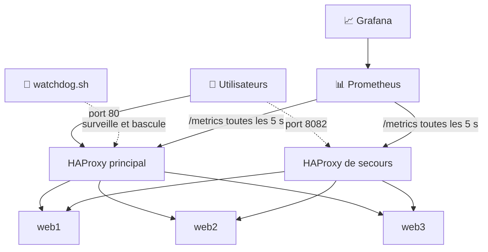

# ⚖️ Répartition de charge haute disponibilité avec HAProxy et Docker

Projet de fin d'études : une plateforme web **haute disponibilité** construite avec **HAProxy**, **Docker Compose**, **Prometheus** et **Grafana**, sous **Ubuntu**.

L'objectif : que le site reste accessible **même si un serveur web tombe**, et même si **le répartiteur de charge lui-même tombe**.

---

## 🏗️ Architecture



Tous les conteneurs communiquent sur un réseau Docker privé : `lb_net`.

## 🧩 Les composants

| Conteneur | Rôle | Accès |
|---|---|---|
| `web1`, `web2`, `web3` | Serveurs web applicatifs. Chacun affiche son numéro, ce qui permet de voir la répartition | internes uniquement |
| `haproxy` | Répartiteur de charge principal (algorithme *round robin*) | http://localhost |
| `haproxy-backup` | Répartiteur de secours, même configuration que le principal | http://localhost:8082 |
| Statistiques HAProxy | Tableau de bord de l'état des serveurs | http://localhost:8405/stats (principal), http://localhost:8406/stats (secours) |
| `prometheus` | Collecte des métriques des deux HAProxy toutes les 5 secondes | http://localhost:9091 |
| `grafana` | Visualisation des métriques sous forme de tableaux de bord | http://localhost:3000 |

## 📁 Structure du projet

```
.
├── docker-compose.yml      # Définit les 7 conteneurs et le réseau lb_net
├── start.sh                # Démarrage fiable et vérification automatique
├── watchdog.sh             # Surveillance du HAProxy principal et bascule
├── haproxy/
│   └── haproxy.cfg         # Configuration HAProxy (utilisée par les deux HAProxy)
├── prometheus/
│   └── prometheus.yml      # Cibles de supervision
├── web1/                   # Serveur web n°1 (image construite localement)
├── web2/                   # Serveur web n°2
└── web3/                   # Serveur web n°3
```

## 🛡️ Les mécanismes de haute disponibilité

**1. Répartition de charge.** HAProxy distribue les requêtes chacun son tour entre `web1`, `web2` et `web3` (`balance roundrobin`).

**2. Vérification de santé des serveurs.** Toutes les 3 secondes, HAProxy envoie une requête `GET /` à chaque serveur et attend un code `200`. Un serveur est retiré après **3 échecs** et réintégré après **2 succès** (`check inter 3s fall 3 rise 2`).

**3. Redémarrage automatique.** Chaque conteneur est configuré avec `restart: unless-stopped` : Docker relance automatiquement un conteneur qui plante.

**4. Démarrage robuste.** HAProxy utilise le DNS interne de Docker (`127.0.0.11`) avec `init-addr last,libc,none`, pour ne pas échouer au démarrage si un serveur web n'est pas encore prêt.

**5. Bascule du répartiteur (failover).** Le script `watchdog.sh` teste le site toutes les 3 secondes. Après **3 échecs consécutifs**, il supprime le conteneur `haproxy` défaillant et lance un nouveau répartiteur, `haproxy-active`, sur le port 80. Le site redevient accessible sans intervention humaine.

## ⚙️ Prérequis

- Ubuntu (ou une autre distribution Linux)
- Docker et Docker Compose (v2, commande `docker compose`)
- `curl`

## 🚀 Démarrage

```bash
git clone https://github.com/sabir489/haproxy-docker-haute-disponibilite.git
cd haproxy-docker-haute-disponibilite
chmod +x start.sh watchdog.sh
./start.sh
```

Le script `start.sh` fait tout automatiquement, en 4 étapes :
1. il supprime les conteneurs restés d'une exécution précédente ;
2. il vérifie que le port 80 est libre ;
3. il construit et démarre les 7 conteneurs ;
4. après 12 secondes, il vérifie que tout fonctionne, affiche les adresses d'accès et teste la répartition. En cas d'échec, il affiche les journaux du conteneur en cause.

## 🧪 Tests

### Test 1 : la répartition de charge

```bash
for i in 1 2 3 4 5 6; do curl -s localhost | grep -o 'numéro [0-9]'; done
```

Les réponses alternent entre les serveurs : numéro 1, numéro 2, numéro 3, numéro 1…

### Test 2 : la panne d'un serveur web

```bash
docker stop web2
```

Le site reste accessible : HAProxy détecte la panne et envoie les visiteurs vers `web1` et `web3`. Sur http://localhost:8405/stats, `web2` passe en rouge. Pour le remettre en service :

```bash
docker start web2
```

### Test 3 : la panne du répartiteur principal

Dans un premier terminal :

```bash
./watchdog.sh
```

Dans un second terminal :

```bash
docker stop haproxy
```

Après environ 9 secondes, le watchdog détecte la panne, lance `haproxy-active`, et le site est de nouveau accessible sur http://localhost.

Pour revenir à l'état initial après ce test :

```bash
./start.sh
```

## 📊 Supervision avec Grafana

1. Ouvrir http://localhost:3000 et se connecter avec `admin` / `admin` (Grafana demande de changer le mot de passe à la première connexion).
2. Aller dans **Connections → Data sources → Add data source → Prometheus**.
3. Comme URL, saisir `http://prometheus:9090`, puis cliquer sur **Save & test**.
4. Créer un tableau de bord à partir des métriques `haproxy_*` (par exemple l'état des serveurs ou le nombre de requêtes).

Les métriques brutes sont aussi visibles directement sur http://localhost:8405/metrics.

## 🔧 Si le port 80 est déjà occupé

Si `start.sh` indique que le port 80 est utilisé par un autre programme (Apache, Nginx…), utilisez le port **8090** :

1. dans `docker-compose.yml`, service `haproxy`, remplacer `"80:80"` par `"8090:80"` ;
2. dans `watchdog.sh`, remplacer `MASTER_URL="http://localhost:80"` par `MASTER_URL="http://localhost:8090"`, et `-p 80:80` par `-p 8090:80`.

Le site sera alors accessible sur http://localhost:8090.

## ⚠️ Limites connues

Ce projet est une **démonstration pédagogique** ; ces limites sont assumées :

- **Bascule simplifiée.** Le watchdog recrée un répartiteur sur la même machine. Ce n'est pas une vraie bascule réseau de type **VRRP** avec IP virtuelle, qui nécessiterait plusieurs machines.
- **Bascule unique.** Le watchdog s'arrête après une bascule ; il faut le relancer pour une nouvelle démonstration.
- **Sécurité minimale.** La page de statistiques n'est pas protégée par mot de passe et Grafana utilise les identifiants par défaut. Acceptable en local, à corriger avant tout déploiement réel.
- **Versions non figées.** Prometheus et Grafana utilisent l'étiquette `latest`.

## 🔭 Améliorations possibles

- Bascule réelle avec **Keepalived / VRRP** et une IP virtuelle, sur deux machines
- **HTTPS** avec un certificat TLS sur HAProxy
- Tableaux de bord Grafana et source de données **provisionnés automatiquement**
- **Alertes** avec Alertmanager (par exemple en cas de serveur hors service)
- Protection de la page de statistiques par authentification

## 🛠️ Technologies

HAProxy 2.8 · Docker · Docker Compose · Prometheus · Grafana · Bash · Ubuntu

## 👤 Auteur

**Sabir Abderahim**, ingénieur informaticien, Tchad 🇹🇩
